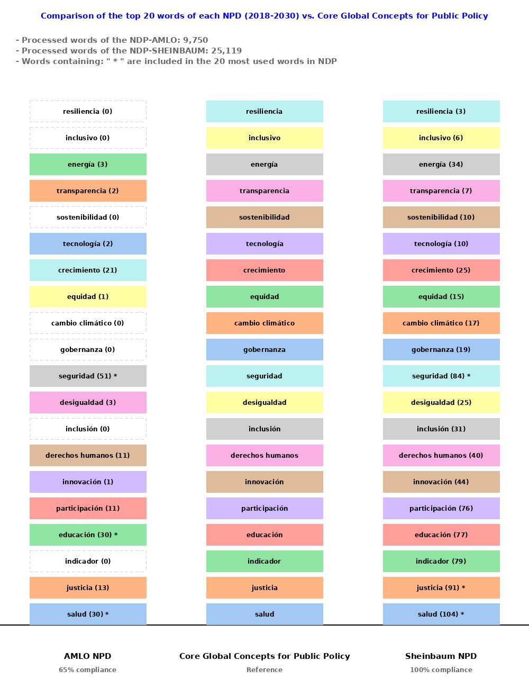

# 💡 Comparative Analysis of Mexico’s National Development Plans (NDP) 2018–30 vs. **Core Global Concepts for Public Policy (CGCPP)**

## Introduction

After analyzing the National Development Plan (NDP) 2019-2024 of the Federal Government in México, it was found that key terms such as transparency, climate change, indicators, clean energy, social justice, human rights, economic growth, technology, innovation, equity, and inclusion were scarcely mentioned throughout the document. These terms embody fundamental concepts for sustainable development and social well-being, and their absence or limited emphasis raises significant concerns from a global perspective.

The lack of a clear focus on transparency and human rights could undermine public trust and institutional legitimacy, which are essential pillars of effective governance. Similarly, deprioritizing technology, innovation, and economic growth risks limiting the country's ability to compete in an increasingly digitalized and competitive global economy.

Moreover, equity and inclusion—critical cross-cutting principles for any public policy—are essential to ensuring that the benefits of development reach all sectors of society, regardless of origin or socioeconomic status.

It is imperative that a plan of this scope integrates these issues not as isolated references, but as core principles guiding the government's vision and actions. Failure to do so risks misalignment with international standards and jeopardizes the country's sustainable development in the long term.


## 📣 Project Overview

This project presents a comparative analysis between Mexico’s **National Development Plans (NDP)** for the periods **2018–2024** and **2025–2030**. The analysis focuses on how frequently the most relevant **Core Global Concepts for Public Policy (CGCPP)** are mentioned across both documents. These core concepts are derived from the recommendations and guidelines of international organizations such as:

- OECD  
- United Nations (UN)  
- Sustainable Development Goals (SDGs)  
- ECLAC  
- IMF  
- World Bank  
- UNDP  
- International IDEA  
- UNESCO  
- COP (Climate Conferences)

The top 20 of **Core Global Concepts for Public Policy (CGCPP)**  are: "Salud,Justicia,Indicador,Educación,Participación,Innovación,Derechos Humanos,
Inclusión,Desigualdad,Seguridad,Gobernanza,Cambio climático,Equidad,Crecimiento,Tecnología,Sostenibilidad,Transparencia,Energía,Inclusivo and Resiliencia".

The methodology is based on textual analysis of both NDPs, processed through three Python notebooks:

- 1. `ReadPND2018.ipynb`: Processes and analyzes the 2018–2024 NDP.
- 2. `ReadPND2025.ipynb`: Processes and analyzes the 2025–2030 NDP.
- 3. `ComparativePNDS.ipynb`: Compares the frequency of CGCPP terms between both plans 
  (It is required to run the firsts two jupyter notebook´s for it to work properly.).

---
## 🔍 Word Count Summary

- **Words processed in NDP-AMLO (2018–2024)**: 9,750  
- **Words processed in NDP-SHEINBAUM (2025–2030)**: 25,119  
---

## 📶 Visual Results

1. Word cloud of words int he 2018–2024 NDP
2. Top 20 most frequent words in the 2018–2024 NDP.
3. Word cloud of words int he 2025–2030 NDP
4. Top 20 most frequent words in the 2025–2030 NDP.
5. Mentions of CGCPP terms in the 2018–2024 NDP.
6. Mentions of CGCPP terms in the 2025–2030 NDP.
7. Side-by-side comparison of CGCPP term inclusion in both NDPs.
   
## 🔑 Key Findings

### Overall Compliance with Global Policy Concepts

- **2018–2024 NDP (AMLO)**: 65% compliance with CGCPP terms.
- **2025–2030 NDP (Sheinbaum)**: 100% compliance with CGCPP terms.

This indicates a significant improvement in the alignment of the newer development plan with international democratic governance and policy best practices.

### Strongest Improvements in CGCPP Term Usage

The following concepts showed substantial increases in the 2025–2030 NDP:

| Term                | 2018–2024 Mentions | 2025–2030 Mentions |
|---------------------|--------------------|--------------------|
| Health              | 30                 | 104                |
| Justice             | 13                 | 91                 |
| Education           | 30                 | 77                 |
| Participation       | 11                 | 76                 |
| Innovation          | 1                  | 44                 |
| Human Rights        | 11                 | 40                 |
| Inclusivity         | 0                  | 31                 |
| Governance          | 0                  | 19                 |
| Climate Change      | 0                  | 17                 |
| Equity              | 1                  | 15                 |
| Indicators          | 0                  | 79                 |
| Energy              | 3                  | 34                 |

### Most Frequent Words Across Both NDPs

Regardless of CGCPP, the most repeated terms across both plans include:

- *Development*  
- *Health*  
- *Security*  
- *Government*  
- *Population*  
- *Social*  
- *Rights*  
- *Well-being*
---

### Graph of CGCPP, the most repeated terms across both plans include:



---

## 📣 Observed Deficiencies and Areas for Improvement

Despite the improved alignment of the 2025–2030 NDP with international public policy concepts, some deficiencies remain:

- **Climate Change (`cambio climático`)**, though present in the new NDP, is mentioned only **17 times**. This is **far below** the threshold of the top 20 most frequent words in the document. Given the global urgency and Mexico's vulnerability to environmental risks, this frequency appears insufficient.
  
- **Resilience**, **inclusivity**, and **sustainability** also fall outside the top 20 most repeated terms, suggesting that these globally critical themes have yet to become central in national discourse.

- The 2018–2024 plan completely **omitted** key global terms such as *governance*, *equity*, *inclusivity*, *resilience*, and *indicators*, reflecting a limited integration of international policy frameworks.

---

## Requirements

To run the notebooks:

- Python 3.10.12
- Jupyter Notebook
- Required Libraries:
  - `pandas`
  - `matplotlib`
  - `seaborn`
  - `nltk`
Details in requirements.txt   
---

## Project Structure

Below is the suggested folder and file structure for this analysis project:

```plaintext
ANALYTICPND2019/
│
├── 
│   ├── ReadPND2018.ipynb          # Processes the NDP 2018–2024
│   ├── ReadPND2025.ipynb          # Processes the NDP 2025–2030
│   └── ComparativePNDS.ipynb      # Compares both NDPs using CGCPP terms
│
├── results/
│   ├── filtered_words_amlo.csv       # Counting AMLO's NDP words
│   ├── filtered_words_Sheinbaum.csv  # Counting Sheinbaum NDP words
│   └── total_words_AMLO.csv          # Total sum of AMLO's NDP words
│   └── total_words_SHE.csv           # Total sum of Sheinbaum NDP words
│   ├── words_desired_AMLO.csv        # Matching total words of AMLO's NDP vs CGCPP
│   ├── words_desired_SHE.csv         # Matching total words of Sheinbaum´s NDP vs CGCPP
│   └── words_desired.csv             # List of  CGCPP words
    └── words_top_AMLO.csv            # The 20 most used words within AMLO's NDP
│   └── words_top_SHE.csv             # The 20 most used words within Sheinbaum's NDP
├── results/images/
│   └── comp_pnds.png                 # Summary of NDP word counts vs. CGCPP terms
│
├── README.md                      # Project overview, analysis summary, and conclusions
└── requirements.txt               # Python libraries needed to run the notebooks


## 💁 Author

Analysis by **Hiram Jiménez Arcos**


### 🔗 References

- 2018–2024 NDP: https://framework-gb.cdn.gob.mx/landing/documentos/PND.pdf
- 2025-2030 NDP: https://www.gob.mx/cms/uploads/attachment/file/981072/PND_2025-2030_v250226_14.pdf


## 📊 Conclusion

The 2025–2030 NDP marks a **notable advancement** in incorporating internationally recognized principles for democratic governance and sustainable development. The plan demonstrates greater attention to inclusivity, human rights, education, health, and justice. However, **climate change and resilience** remain **underrepresented**, signaling a need for deeper integration of environmental sustainability into national planning.

Overall, this analysis provides actionable insights into how Mexico’s policy planning has evolved and where further alignment with global standards can be strengthened.
